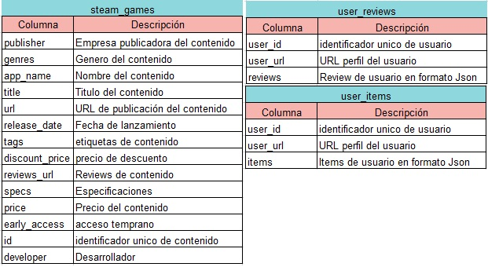

# **Proyecto Individual N°1 (MLOps)**
---

<strong>Índice</strong>

1. [Introducción](#Introducción)
2. [Objetivo](#Objetivo)
3. [Diccionario](#Diccionario-de-Datos)
4. [Transformaciones (ETL)](#Transformaciones-de-Datos-(ETL))
5. [Analisis (EDA)](#Análisis-Exploratorio-de-Datos-(EDA))
6. [API](#Desarrollo-de-las-API)
   - [Desployment](#Deployment)
7. [Machine Learning](#Machine-Learning)
8. [Stack Tecnológico](#Stack-Tecnologico)
9. [Video Explicativo](#Video)
10. [Contacto](#Datos-de-Contacto)

## **Introducción**

---

Este proyecto se enfoca en la creación de una API para gestionar y analizar datos de juegos proporcionados por Steam. Steam es una plataforma de distribución digital de videojuegos ampliamente utilizada por jugadores de todo el mundo. Los datos recopilados de esta plataforma contienen información valiosa sobre los juegos, sus usuarios y sus interacciones.

## **Objetivo**

---

El objetivo principal de este proyecto es desarrollar una API que permita realizar consultas, análisis y recomendaciones específicas utilizando los conjuntos de datos de Steam. Esto incluye la capacidad de buscar información detallada sobre juegos, usuarios, transacciones, así como realizar análisis de tendencias y patrones de comportamiento. Además, se pretende implementar funcionalidades de recomendación de juegos basadas en el análisis de datos. Mi rol en este proyecto abarcó el diseño y desarrollo de la infraestructura de datos, la implementación de algoritmos de aprendizaje automático y la gestión del proceso de entrega y despliegue del proyecto.

## **Diccionario de Datos**

---

## **Transformaciones de Datos (ETL)**

---

Se realizó la lectura de los dataset con el formato correcto, incluyendo su limpieza, organización y preparación para optimizar las  consultas que se realicen, el rendimiento de la API, el entrenamiento del modelo de aprendizaje automático.

Se creó la columna 'sentiment_analysis' aplicando análisis de sentimiento a las reseñas de juegos en el dataset 'user_reviews'. Esta columna representa la polaridad del sentimiento en una escala de 0 a 2 (0 malo, 1 neutral o falta de reseña, 2 positivo).

## **Análisis Exploratorio de Datos (EDA)**

---

Se realizó un análisis exploratorio de los datos, ayuda a comprender la naturaleza y distribución de los datos.

## **APIS**

---

Se disponibilizó los datos utilizando FastAPI. Los endpoints propuestos para consumir la API son:

- *play_time_genre(genero: str):*
Devuelve el año con más horas jugadas para un género específico.

- *user_for_genre(genero: str):*
Proporciona el usuario con más horas jugadas para un género y una lista de la acumulación de horas jugadas por año.

- *users_recommend(año: int):*
Retorna el top 3 de juegos más recomendados por usuarios para el año especificado.

- *users_worst_developer(año: int):*
Obtiene el top 3 de desarrolladoras con juegos menos recomendados por usuarios para el año dado.

- *sentiment_analysis(empresa_desarrolladora: str):*
Según la empresa desarrolladora, devuelve un diccionario con la cantidad total de registros de reseñas categorizados por análisis de sentimiento.

### **Deployment**

Con el fin de garantizar una creación y despliegue efectivos de las APIs, organicé el trabajo en dos archivos. En el archivo [funciones.py](https://github.com/delfinap5/PI-MLOps_STEAM_DELFINA/blob/main/funciones.py), se encuentran funciones adicionales necesarias para complementar cada API. Estas están diseñadas para obtener y preparar los datos específicamente para cada endpoint definido en 'main.py'.
Por otro lado, en el archivo [main.py](https://github.com/delfinap5/PI-MLOps_STEAM_DELFINA/blob/main/main.py), se encuentran las funciones finales de los endpoints, listas para ser utilizadas en FastAPI y desplegadas en Render.

Puedes acceder a la API desplegada a través de este enlace: [API Steam](https://apisteamdelfina.onrender.com/docs)

## **Machine Learning**

---

Se utilizó el enfoque para el sistema de recomendación de ítem-ítem para recibir recomendaciones de juegos similares a un producto.
- *def recomendacion_juego( id de producto)*: Ingresando el id de producto, deberíamos recibir una lista con 5 juegos recomendados similares al ingresado.

## **Stack Tecnológico**

---
Utilicé las siguientes Tecnologías:

### **Editor de código:**

- 
  
  Para escribir, depurar y administrar tu código.

### **Lenguaje de Programación:**

- 
  
  Para el desarrollo de la lógica y la funcionalidad de tu aplicación.

### **Bibliotecas de Análisis de Datos:**

- 

  Para operaciones numéricas eficientes.

- 
  
  Para manipulación y análisis de datos estructurados.

### **Framework Web:**

- 
  
  Para crear APIs rápidas y modernas.

### **Aplicaciones de Productividad:**

- 
  
  Para procesamiento de datos y análisis.

- 
  
  Para comunicación en línea y videoconferencias.

### **Renderización y Compresión de Datos:**

- 
  
  Para renderización de datos (no estoy seguro si te refieres a alguna biblioteca específica).

- 
  
  Para compresión de archivos y datos.

### **Manipulación de Datos y Texto:**

- 
  
  Para manejar datos en formato JSON.
  
- 
  
  Para análisis de árboles sintácticos abstractos.
  
- 
  
  Para operaciones de archivos y directorios.
  
- 
  
  Para expresiones regulares.
  
- 
  
  Para procesamiento de lenguaje natural, específicamente para análisis de sentimientos con SentimentIntensityAnalyzer.
  
- 
  
  Para extracción de características de texto con TfidfVectorizer.

### **Operaciones de Fecha y Hora:**

- 

  Para manipulación de objetos de fecha y hora.

### **Servidor Web y Despliegue:**

- 

  Para ejecutar el servidor web ASGI que sirve tu aplicación FastAPI.

## **Video**

---

Este video es explicativo y desarrolla el contenido del proyecto
[Link del desarrollo del proyecto](https://drive.google.com/drive/folders/1P68YjR5G0JpGXKHdHUULH8FPbCD85dsF?usp=sharing)

## **Contacto**

---

- Gmail: delfinapena55@gmail.com
- LinkedIn: [LinkedIn](www.linkedin.com/in/delfina-longo-peña-44b4b623b)
- Github: [delfinap5](https://github.com/delfinap5)
- Curriculum: [CV](https://drive.google.com/drive/folders/1W83x9TqqUa2tFrnDEkXd3ZCLhew8pJ-R?usp=drive_link)
